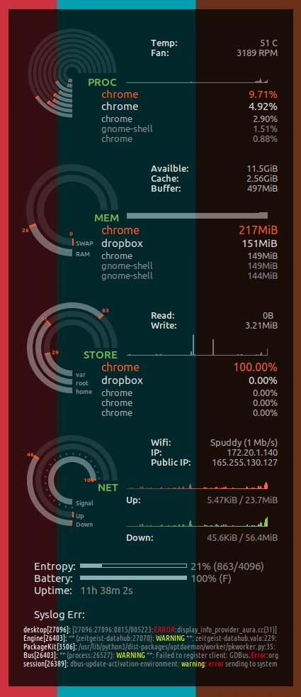

Conky Seamod theme
====================

Seamod theme was built by SeaJey. Maxiwell modified the original theme for conky 1.10 configuration. I tweaked it further with some major changes.

# Screenshot



# New Features

## by Maxiwell

- Disk Read/Write
- Lan/Ext IP's

## by JPvRiel

Fixes

- `border_outer_margin` can be adjusted without breaking the alignment of rings.
- now runs on Ubuntu 16.04 LTS with Gnome 3.18 using `dock` or `normal` window type and hints.

Changes/enhancements

- gracefully accommodates switching between wired and wireless. NET section shows info for wired (eth0) else wireless (wlan0) info is shown.
- `own_window_argb_value` conifg option for background and semi-transparency settings.
- `conky_line` superceeds 'name' and 'arg' options to use more complex conkey objects and variables in `seamod_rings.lua`
- 'Free' text info moved to the bottom so changes avoid interfering with alignment of rings/gauges.
- Tweaked info per section, e.g. CPU temp, fan RPM, memory cache, etc.
- Added IO top info for disk / storage (matches top list for memory and processor).
- Added a few extra conky lua functions to calculate the min, max and average frequency of the cpu cores (requires `nproc` command), given this influences CPU temperature and fan speed.
  - Min to Max value added as 'Freq:' near the top under 'Temp:' and 'Fan:' values.
  - One can use `${nproc}`, `${freq_min}`, `${freq_max}`, and `${freq_avg}` elsewhere in the conky TEXT section.
- Added example script to feed last 5 warning or error messages from syslog.

# Install and run

Install within your home dir (should work in Gnome 3 at least)
```bash
sudo apt-get install conky-all
mkdir -p ~/.conky/seamod
git clone --depth=1 https://github.com/JPvRiel/conky-seamod ~/.conky/seamod
cp ~/.conky/seamod/conky.desktop ~/.config/autostart/
ln -s ~/.conky/seamod/conkyrc.lua ~/.conkyrc
```

Start (ad-hoc in shell, useful for debugging)
```
conky -c ~/.conky/seamod/conkyrc.lua
```

Stop
```
killall conky
```

Hints

- Install location assumes `~/.conky/seamod`. If not, correct script references in `conkyrc.lua`.
- For auto-start, `conky.desktop` may need other tweaks for auto-start with other desktop environments.

# Modifying

Hardware such as number of CPU cores, the place to get temperatures and even the way in which network devices are named varies, so at least one or two modifications will likely be needed. Herewith, the most likely changes that are typically needed.

## Adjusting the number of rings

Modify CPU rings in `seamod_rings.lua`'s `gauge` data structure list.

- Change the number of 'cpu' items  match the output of the `nproc` command. Simply comment out or remove `cpu` items in the list. Default is 8 'CPU' instances (cores and hyper threads).
- Change 'fs_used_perc' items to suite systems partitioning scheme. E.g. default has 'root', 'home' and 'var' separate.

Ring/gauge sections

- In `conkyrc.lua`
  - 3 lines of info are accommodated above the graph sections - substitute as you deem fit, but keep the spacing at 3 lines to avoid misalignment between rings and text.
- In `seamod_rings.lua`
  - Fiddle with `graph_radius`, `graph_thickness` and if used, `txt_radius`, so adjust ring sizing.
  - In `gauges` items, use `conky_line` instead of `name` and `arg` if advanced objects are needed.

### Keeping the rings and text info aligned

*N.B!* Alignment between rings and the text is painfully brittle. So avoid changing the number of lines in the text section that algin next to rings. See limitations section below for why...

Best place to add own text or info is under `# Extra info`. And to make room, you can remove some lines. This section is past where the rings are rendered.

## Setting appropriate network names

Modify network to monitor - sorry, this is messy!

- Find and replace names for `eth0` (typical for wired) and `wlan0` (typical for wireless) if your own device names differ.
- Recently, systemd has changed the way devices are named, i.e. based on firmware or BIOS (see RedHat doc [Consistent Network Device Naming - Naming Schemes Hierarchy](https://access.redhat.com/documentation/en-US/Red_Hat_Enterprise_Linux/7/html/Networking_Guide/ch-Consistent_Network_Device_Naming.html)
  - So it's going to be system specific and `eth0` or `wlan0` defaults are no longer as useful.
- Needs to be done in both `seamod_rings.lua` and `conkyrc.lua`

E.g. fix.

```
sed -i -e 's/eth0/eth1/g' ~/.conky/seamod/conkyrc.lua  ~/.conky/seamod/seamod_rings.lua
```

## Hardware monitor info like CPU temperature and fan speed

CPU and fan temperature uses the `hwmon` conky variable. You'll need to find your hardware specific path and inputs somewhere in `/sys/class/hwmon/*`. Sadly, some systems might not consistently use hwmon1 vs hwmon0 between boots.

To have an idea about what got mapped to which hwmon, the example below can help...

```bash
$ for h in /sys/class/hwmon/hwmon?; do echo "$h = $(cat "$h/name")"; done
/sys/class/hwmon/hwmon0 = acpitz
/sys/class/hwmon/hwmon1 = coretemp
/sys/class/hwmon/hwmon2 = radeon
/sys/class/hwmon/hwmon3 = dell_smm
```

And, if like me, you also have coretemp (for Intel), then

```bash
$ cat /sys/class/hwmon/hwmon1/temp?_label
Physical id 0
Core 0
Core 1
Core 2
Core 3
```

Also fan speed probably found with the motherboard, e.g. 

```bash
$ cat /sys/class/hwmon/hwmon3/fan1_label 
Processor Fan
```

So in my case, I wanted
```
Temp: ${hwmon 1 temp 1} [${hwmon 1 temp 2}, ${hwmon 1 temp 3}, ${hwmon 1 temp 4}, ${hwmon 1 temp 5}] C
Fan: ${hwmon 3 fan 1} RPM
Freq: ${alignr}${font Ubuntu:size=10:style=normal}${color2}${lua freq_avg} [ ${lua freq_min} - ${lua freq_max} ] MHz
```

If you choose more or less than 3 things, alignment with rings break... #sadpanda

## Other misc stuff (change as you please)

- Entropy pool bar for crypto nerds may be arb and can be removed. Delete line with `entropy_bar` etc.
- You might prefer not to see how often errors and warnings are spat out by syslog. Delete line with `{texecpi 60 ~/.conky/seamod/syslog-err-feed.sh}`

# Bugs / Limitations / TODO

## Network changes

While `if_up` looks simpler, conky's `if_up` object triggers a seemingly benign stream of `SIOCGIFADDR: Cannot assign requested address` errors when used with the `if_up_strictness = 'address'` config option.

`${ip_up eth0}` is commented out and replaced with a more cumbersome (but reliable) option `${if_match "${addr eth0}" != "No Address"}` as the workaround.

## Multiple screens

Conky always displays on the rightmost screen's edge, given many desktops and graphics drivers setup the display as one large X screen and resolution.

- The `xinerama_head` option is supposed to help pin/dock the window to the first screen, but requires a very recent version of conkey (and Ubuntu 16.04 LTS only packaged v1.10.1 without the fix)
- Example issue [here](https://github.com/brndnmtthws/conky/issues/249) and [here](https://github.com/brndnmtthws/conky/issues/172).

## TODO: Dynamic conky rings

It's admittedly tedious for users with differing hardware to have to tweak `conkyrc.lua` and fight with spacing. 

I imagine that for perfomance reasons, the lua code to setup and render the rings was done statically and once-off, hence it's non-trival handling plaform differences. A major re-write would try to allow the number of rings to adjust according to:

- Number of cores the user has.
- Scale the core ring size according to current core frequency, .e.g.
  - Take into account 100% at 800MHz frequency is not the same as 100% at 2800MHz frequency.
- Number of file-system partitions the user wants to monitor.

### TODO: Include current CPU frequency in ring size

Leverage this info to scale the size of the CPU wring so that only 100% at max frequency produces a full ring

```
$ cat /sys/devices/system/cpu/cpu0/cpufreq/cpuinfo_min_freq
800000
$ cat /sys/devices/system/cpu/cpu0/cpufreq/cpuinfo_max_freq
3800000
$ cat /sys/devices/system/cpu/cpu0/cpufreq/scaling_cur_freq
3051671
```

Other considerations:

- CPU base frequency (not same as max/turbo boost), e.g. 2.8 GHz vs 3.8 GHz
- CPU cores versus threads

Depends on fully refactoring the lua code to draw rings.

# Related Work

Click [here](http://www.deviantart.com/art/Conky-Seamod-v0-1-283461046) to see the original theme and screenshots.
Click [here](https://github.com/maxiwell/conky-seamod) for repo with previous version
